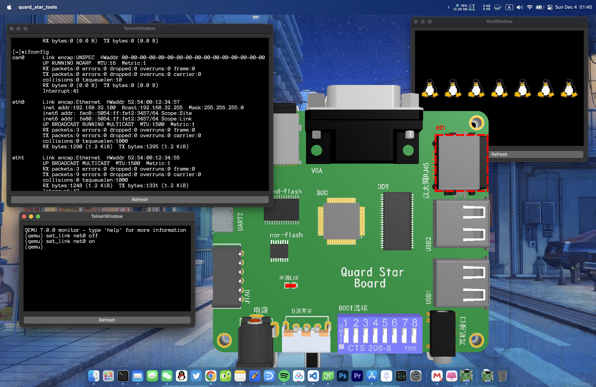

# ext6. 嵌入式Linux上ifpulgd的使用配置与qemu模拟验证

## 问题引入

最近在项目开发中收到了一个非常简单的需求，我们的嵌入式Linux板卡需要在检测到网口插拔后重新配置网络，这在pc环境中非常常见。但是在这个项目的默认SDK中并没有相关配置，稍微查询了一下，在一般pc上通常使用Ifpulgd,并且在较新的busybox中已经提供了这个实用程序，而我们使用的旧版并未提供，因此我这里记录下使用和配置过程并且在qemu中进行了模拟验证。

## ifpulgd编译

ifpulgd非常简单，下载最新的 busybox源码，编译生成的 ifpulgd位于/usr/sbin中。

## 启动脚本与配置

busybox并沒有提供示例说明，这里我提供一个启动脚本 /etc/init.d/S50ifpulgd.sh

```bash
#! /bin/sh
#
# ifplugd  init.d script
test  -x /usr/sbin/ifplugd || exit 0
test  -f /etc/ifplugd/ifplugd.conf || exit 0

source /etc/ifplugd/ifplugd.conf

case "$1" in
  start)
    echo -n "Starting ifplugd: "
	for i in $INTERFACES
	do
    /usr/sbin/ifplugd -pq -t1 -u1 -d1 -i $i -r /etc/ifplugd/ifplugd.action
	done
    echo "OK"
	;;
  stop)
	echo -n "Stopping ifplugd: "
	for i in $INTERFACES
	do
	kill $(cat /var/run/ifplugd.$i.pid)
	done
	echo "OK"
	;;
  restart|force-reload)
	$0 stop
	sleep 2
	$0 start
	;;
  *)
	echo "Usage: $0 { start | stop | restart | force-reload }" >&2
	exit 1
	;;
esac

exit 0
```

启动脚本通过访问/etc/ifplugd/ifplugd.conf配置文件获取要监控的ETH,然后启动守护进程分别监控ETH接口状态变化，一旦发生变动/etc/ifplugd/ifplugd.action来重新配置网络。

/etc/ifplugd/ifplugd.conf

```
INTERFACES="eth0 eth1"
```

/etc/ifplugd/ifplugd.action

```bash
#! /bin/sh

case "$2" in
  up)
	/sbin/ifup $1
	;;
  down)
	/sbin/ifdown $1
	;;
  *)
	echo "Usage: /etc/ifplugd/ifplugd.action [interface] { up | down }" >&2
	exit 1
	;;
esac

exit 0
```

## qemu模拟

ok，完成配置脚本编写后我们可以直接上机实测，功能很简单。但是孰悉我的朋友都知道我会尽可能的把开发板上的功能上qemu上模拟，那么qemu如何实现网络接口的插拔呢？其实很简单在qemu的monitor终端输入：

```
set_link net0 off
set_link net0 on
```

就可以实现与真实板卡上一样的效果了。下图是在我的博客[《基于qemu-riscv从0开始构建嵌入式linux系统》](https://blog.csdn.net/weixin_39871788/article/details/118469061)中搭建的平台上测试ifplugd效果的示意图，本文全部相关源码全部都更新到该开源项目中，欢迎大家查阅。
github仓库：[https://github.com/QQxiaoming/quard_star_tutorial](https://github.com/QQxiaoming/quard_star_tutorial)
gitee仓库：[https://gitee.com/QQxiaoming/quard_star_tutorial](https://gitee.com/QQxiaoming/quard_star_tutorial)



